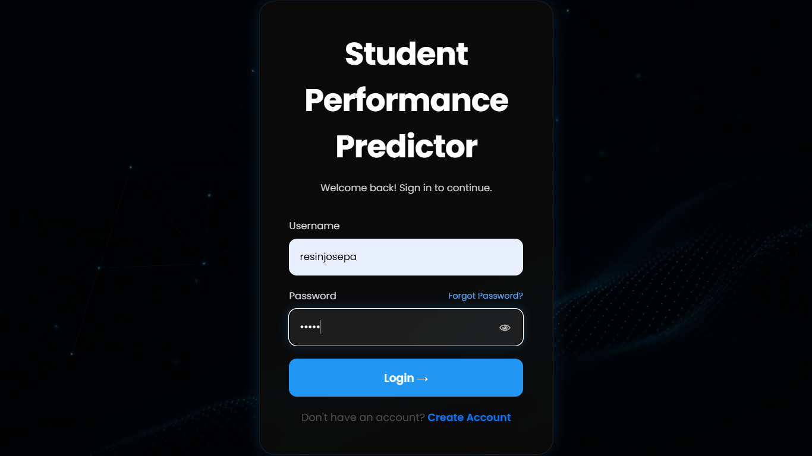
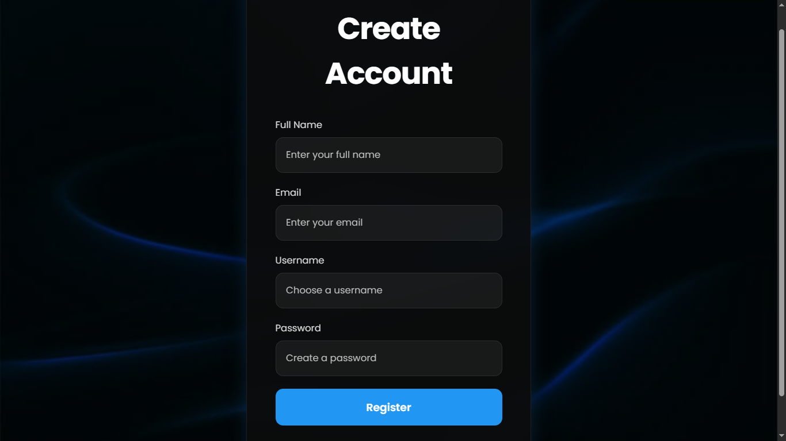
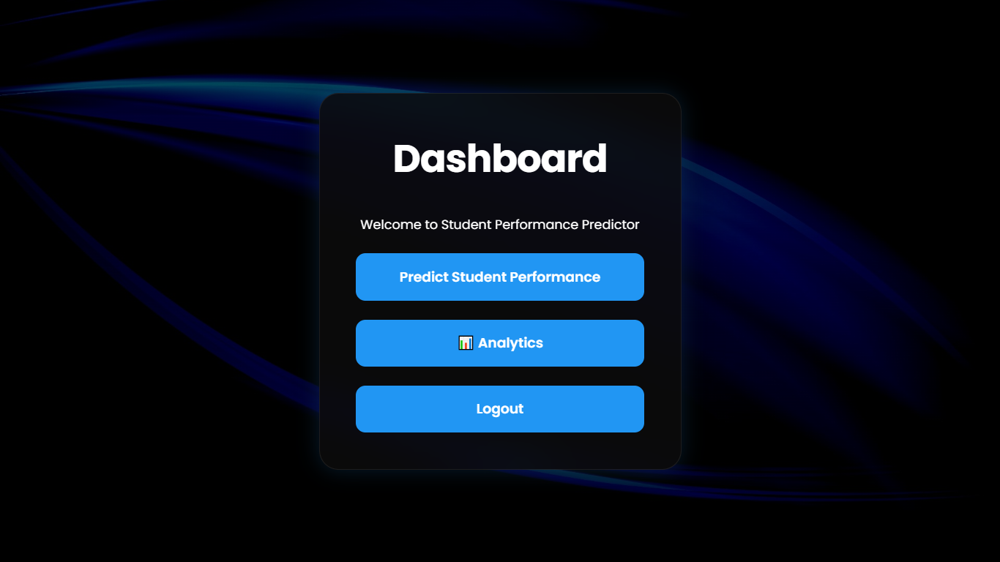
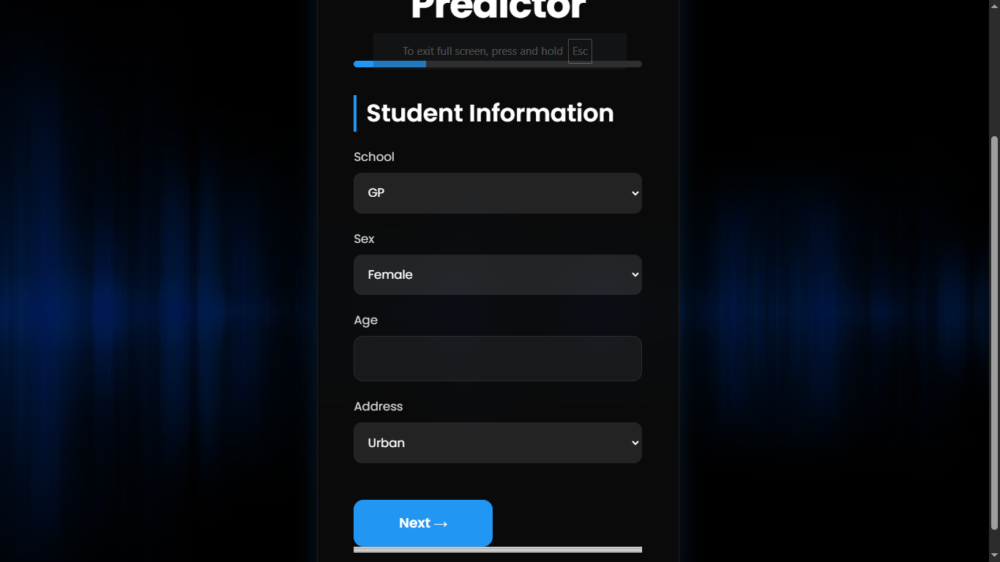
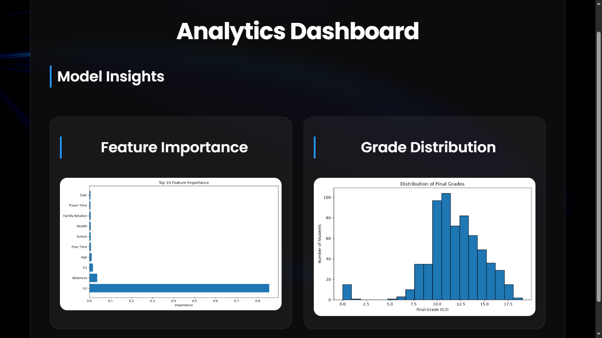
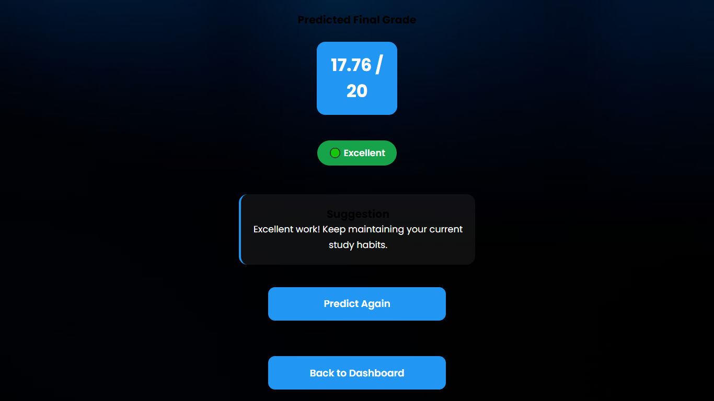

# 🎓 Student Performance Predictor

A Machine Learning web application built with **Flask** that predicts a student's final academic performance using a **Random Forest Regression** model. The application features a modern web interface, secure user authentication, analytics, and interactive prediction results.

---

## 📖 Project Overview

Student Performance Predictor helps estimate a student's final grade (G3) based on academic, family, and lifestyle factors.

The project combines **Machine Learning** with **Web Development** by integrating a trained Random Forest Regression model into a Flask application with a responsive user interface.

---

## ✨ Features

### 🔐 User Authentication
- User Registration
- Secure Login
- Logout

### 📊 Student Performance Prediction
- Random Forest Regression Model
- Multi-Step Prediction Form
- Predict Final Grade (G3)

### 📈 Analytics Dashboard
- Feature Importance Chart
- Grade Distribution Chart

### 🎯 Prediction Result
- Predicted Grade
- Performance Level
- Personalized Suggestions
- Predict Again option

### 🎨 Modern User Interface
- Dark SaaS-inspired Design
- Individual Background Images for Pages
- Responsive Layout
- Clean Navigation

---

## 🛠️ Technologies Used

### Programming Language
- Python

### Backend
- Flask
- SQLite

### Machine Learning
- Scikit-learn
- Random Forest Regressor
- Pandas
- NumPy
- Joblib

### Data Visualization
- Matplotlib

### Frontend
- HTML5
- CSS3
- JavaScript

---

## 📂 Project Structure

```text
student-performance-predictor/
│
├── app.py
├── main.py
├── database.py
├── random_forest.pkl
├── label_encoders.pkl
├── student-por.csv
├── requirements.txt
├── README.md
├── .gitignore
│
├── static/
│   ├── css/
│   ├── js/
│   ├── charts/
│   └── images/
│
└── templates/
    ├── login.html
    ├── register.html
    ├── home.html
    ├── dashboard.html
    ├── predict.html
    ├── analytics.html
    └── result.html
```

---

## 📸 Application Screenshots

### Login Page



---

### Home Page


---

### Register Page



---

### Dashboard



---

### Prediction Page



---

### Analytics Dashboard



---

### Result Page



---

## ⚙️ Installation

### Clone the repository

```bash
git clone https://github.com/resinjosepa/student-performance-predictor.git
```

### Navigate to the project

```bash
cd student-performance-predictor
```

### Install dependencies

```bash
pip install -r requirements.txt
```

### Run the application

```bash
python app.py
```

Open your browser and visit:

```
http://127.0.0.1:5000
```

---

## 📊 Machine Learning Model

- Algorithm: Random Forest Regression
- Dataset: Student Performance Dataset
- Target Variable: G3 (Final Grade)

### Input Features

The model predicts the final grade using student information such as:

- Personal Information
- Family Background
- Academic Performance
- Lifestyle Factors
- Previous Grades (G1 & G2)

---

## 📈 Analytics

The application includes:

- Feature Importance Visualization
- Grade Distribution Analysis

These visualizations help understand both the dataset and the trained model.

---

## 🚀 Future Improvements

- Reduce unnecessary input features based on mentor feedback
- Improve dashboard UI
- Enhance result page insights
- Add model retraining support

---

## 👩‍💻 Author

**Resin Josepa**

BE CSE (First Year)

Thiagarajar College of Engineering

GitHub: https://github.com/resinjosepa

---

## 📄 License

This project is licensed under the MIT License.